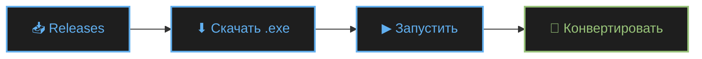
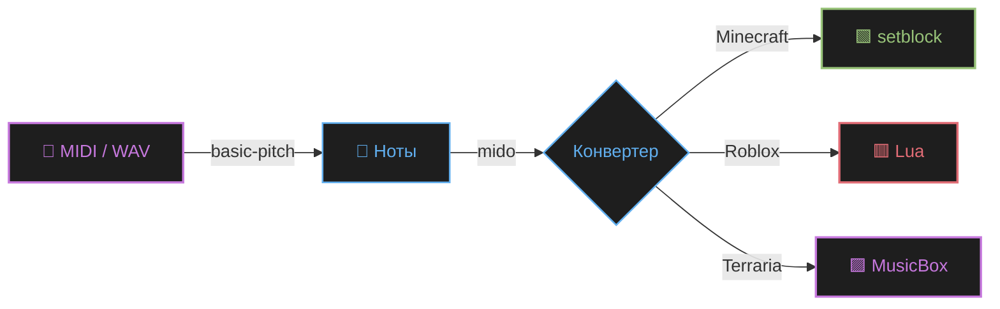

<div align="center">


<br>

### 🎹 MIDI → Minecraft · Roblox · Terraria

<br>

<a href="https://github.com/SMisha2/AstraConv/releases/latest">
  
</a>
<a href="https://github.com/SMisha2/AstraConv/issues">
  
</a>
<a href="https://github.com/SMisha2/AstraConv/stargazers">
  
</a>

<br><br>

<sub>


</sub>

</div>

<br>

---

<br>

<div align="center">

## 📸 Скриншоты

</div>

<div align="center">

<table>
<tr>
<td align="center" width="50%">

<br><br>
<b>🖥️ Главное окно</b>
<br>
<sub>Загрузка MIDI и конвертация</sub>
</td>
<td align="center" width="50%">

<br><br>
<b>⚙️ Настройки</b>
<br>
<sub>Детализация, аккорды, анимации</sub>
</td>
</tr>
<tr>
<td align="center" width="50%">

<br><br>
<b>🎮 Minecraft</b>
<br>
<sub>Команды <code>/setblock</code> для нотных блоков</sub>
</td>
<td align="center" width="50%">

<br><br>
<b>📊 Визуализация</b>
<br>
<sub>Подсветка клавиш в реальном времени</sub>
</td>
</tr>
</table>

<sub><i>Скриншоты можно найти в папке <code>docs/</code></i></sub>

</div>

<br>

---

<br>

<div align="center">

## 🎯 Что это

</div>

**AstraConv** — приложение для Windows, которое конвертирует **MIDI-файлы в игровые форматы**. Один клик — и мелодия превращается в команды для нотных блоков Minecraft, Lua-скрипт для Roblox Piano или данные для музыкальной шкатулки Terraria.

Помимо конвертации — **полноценная студия**: воспроизводит MIDI через SoundFont, визуализирует ноты в реальном времени на виртуальной клавиатуре, поддерживает 4 уровня детализации для точного контроля над результатом.

<br>

<details>
<summary><b>📑 Содержание</b> <i>(нажмите, чтобы развернуть)</i></summary>

<br>

- [Возможности](#-возможности)
- [Установка](#-установка)
- [Игровые форматы](#-игровые-форматы)
- [Настройки](#-настройки)
- [Горячие клавиши](#-горячие-клавиши)
- [FAQ](#-faq)
- [Стек](#-стек)
- [Вклад](#-вклад)
- [Лицензия](#-лицензия)

</details>

<br>

---

<br>

<div align="center">

## 🌟 Возможности

</div>

<table>
<tr>
<td width="50%" valign="top">

### 🎮 Игровые форматы

- 🟩 **Minecraft** — команды `/setblock` для нотных блоков
- 🟥 **Roblox** — готовый Lua-скрипт для Piano
- 🟪 **Terraria** — данные для Music Box
- 🎚️ Авто-выбор инструмента по громкости

### 🎼 Обработка MIDI

- 🎯 **4 уровня детализации** (low / medium / high / ultra)
- 🔗 Умная группировка нот в аккорды
- ⚙️ Настраиваемый порог аккордов
- 📏 Ограничение на количество нот
- 🎵 Точная конвертация с учётом BPM

</td>
<td width="50%" valign="top">

### 🎹 Аудио и визуализация

- 🎼 **Воспроизведение MIDI** через SoundFont
- 🎨 **Реал-тайм визуализация** на клавиатуре
- ✨ Подсветка играющих нот
- 🔊 FluidSynth + pygame интеграция

### 🎨 Интерфейс

- 🌑 **Тёмная тема** в стиле One Dark Pro
- ⭐ Анимированный звёздный фон
- 📑 Боковая навигация по вкладкам
- 🌈 5 акцентных цветов для разных секций
- ⌨️ Горячие клавиши для всего

</td>
</tr>
</table>

<br>

---

<br>

<div align="center">

## 🚀 Установка

</div>

### ⚡ Готовый `.exe` *(рекомендуется)*



1. Откройте [**Releases**](https://github.com/SMisha2/AstraConv/releases/latest)
2. Скачайте `AstraConv.exe`
3. Запустите — установка не требуется

<br>

> [!WARNING]
> **Антивирус может ругаться** — это ложное срабатывание PyInstaller.
> Добавьте файл в исключения: *Windows Defender → Защита от вирусов → Исключения*.

<br>

### 🐍 Из исходников

```bash
# 1. Клонируйте репозиторий
git clone https://github.com/SMisha2/AstraConv.git
cd AstraConv

# 2. Установите зависимости
pip install mido tkinterdnd2 requests
pip install basic-pitch[onnx] onnxruntime

# 3. Запустите
python AstraConv.py
```

<br>

<details>
<summary><b>🛠️ Сборка .exe через PyInstaller</b></summary>

<br>

```bash
pip install pyinstaller

pyinstaller --noconfirm --clean --onefile --noconsole ^
    --name AstraConv ^
    --icon "assets/icon.ico" ^
    --collect-all basic_pitch ^
    --collect-all librosa ^
    --collect-all soundfile ^
    --collect-all resampy ^
    --collect-all numba ^
    --collect-all llvmlite ^
    --collect-all pretty_midi ^
    --collect-all mir_eval ^
    --collect-submodules scipy ^
    --hidden-import tkinterdnd2 ^
    --hidden-import mido ^
    --hidden-import onnxruntime ^
    --exclude-module tensorflow ^
    --exclude-module keras ^
    --exclude-module torch ^
    --exclude-module matplotlib ^
    --exclude-module pandas ^
    --exclude-module PyQt5 ^
    --exclude-module PyQt6 ^
    AstraConv.py
```

Готовый файл появится в `dist/AstraConv.exe`.

</details>

<br>

---

<br>

<div align="center">

## 🎮 Игровые форматы

</div>

### 🟩 Minecraft 1.21.9

Генерирует команды `/setblock` для создания нотных блоков на координатах `~0 ~ ~`.

```mcfunction
/setblock ~0 ~ ~ minecraft:note_block{note:0,powered:1b,instrument:harp}
/setblock ~1 ~ ~ minecraft:note_block{note:5,powered:1b,instrument:pling}
/setblock ~2 ~ ~ minecraft:note_block{note:12,powered:1b,instrument:basedrum}
```

| Диапазон | Инструмент | Условие |
|:---:|:---:|:---|
| `velocity < 40` | `harp` | Тихие ноты |
| `40 ≤ velocity < 80` | `basedrum` | Средние ноты |
| `velocity ≥ 80` | `pling` | Громкие ноты |

> 📏 **Доступный диапазон:** C2–A3 (MIDI 36–57)

<br>

### 🟥 Roblox Piano

Генерирует готовый **Lua-скрипт** для автоматического воспроизведения:

```lua
-- Roblox Piano Script generated by AstraConv
local piano = workspace.Piano
local notes = {
    {time = 0.00, key = 'Key_C4', velocity = 100},
    {time = 0.50, key = 'Key_E4', velocity = 95},
    {time = 1.00, key = 'Key_G4', velocity = 110},
}

local function playNote(noteData)
    local key = piano:FindFirstChild(noteData.key)
    if key then
        key.Transparency = 0.5
        game:GetService("Debris"):AddItem(key, 0.2)
        print("Playing note:", noteData.key)
    end
end
```

> 📏 **Доступный диапазон:** C1–C7 (все MIDI-ноты)

<br>

### 🟪 Terraria Music Box

Генерирует данные в формате `номер_бита: ноты`:

```text
# Terraria Music Box Data (AstraConv)

0: C4 E4 G4
1: D4 F4 A4
2: E4 G4 B4
```

> 📏 **Доступный диапазон:** C3–C5 (MIDI 48–72)

<br>

---

<br>

<div align="center">

## ⚙️ Настройки

</div>

### 🎯 Уровень детализации

| Уровень | Описание |
|:---:|:---|
| **low** | Минимальная — группирует близкие ноты, объединяет до 3 нот в аккорд |
| **medium** | Стандартная — оптимальный баланс между точностью и читаемостью |
| **high** | Максимальная — каждая нота отдельно, аккорды сохраняются |
| **ultra** | Экстремальная — без какой-либо оптимизации |

### 🔗 Порог аккордов

Определяет, насколько близко по времени должны идти ноты, чтобы считаться одним аккордом.

```text
0.01с  ─── Точные аккорды (для чётких MIDI)
0.025с ─── Стандарт ✅
0.05с  ─── Мягкая группировка
0.10с  ─── Максимальное объединение
```

<br>

---

<br>

<div align="center">

## ⌨️ Горячие клавиши

</div>

<div align="center">

| | | | |
|:---:|:---|:---:|:---|
| <kbd>Ctrl</kbd>+<kbd>M</kbd> | 🎮 Minecraft | <kbd>Ctrl</kbd>+<kbd>R</kbd> | 🎵 Roblox |
| <kbd>Ctrl</kbd>+<kbd>T</kbd> | ⛏ Terraria | <kbd>Ctrl</kbd>+<kbd>O</kbd> | 📂 Открыть MIDI |
| <kbd>Ctrl</kbd>+<kbd>S</kbd> | 💾 Сохранить | <kbd>Ctrl</kbd>+<kbd>C</kbd> | 📋 Копировать |

</div>

<br>

---

<br>

<div align="center">

## 🎼 Поддерживаемые MIDI

</div>

AstraConv использует **[basic-pitch](https://github.com/spotify/basic-pitch)** от Spotify для анализа аудио и **mido** для работы с MIDI-файлами.



**Поддерживаемые форматы:** `.mid`, `.midi`

<br>

---

<br>

<div align="center">

## ❓ FAQ

</div>

<details>
<summary><b>🛡 Антивирус удаляет AstraConv.exe</b></summary>
<br>

Ложное срабатывание PyInstaller. Добавьте файл в исключения:

**Windows Defender → Защита от вирусов → Исключения → Добавить файл.**

</details>

<details>
<summary><b>🎼 MIDI не загружается или пустой результат</b></summary>
<br>

Проверьте, что MIDI содержит хотя бы один `note_on` с `velocity > 0`. Пустые дорожки игнорируются. Также убедитесь, что ноты попадают в диапазон игры:

- **Minecraft:** C2–A3 (MIDI 36–57)
- **Terraria:** C3–C5 (MIDI 48–72)
- **Roblox:** C1–C7 (полный диапазон)

</details>

<details>
<summary><b>🎵 Не воспроизводится MIDI в приложении</b></summary>
<br>

Нужны три компонента:

```bash
pip install pygame midi2audio
```

И **SoundFont-файл** (`FluidR3_GM.sf2`). Положите его в одну из папок:

- `%USERPROFILE%\Documents\SoundFonts\`
- `%USERPROFILE%\SoundFonts\`
- `C:\SoundFonts\`
- рядом с `.exe`

</details>

<details>
<summary><b>🎮 Команды Minecraft не работают в игре</b></summary>
<br>

Команды требуют **прав оператора** на сервере и включённых чит-команд в одиночной игре. Также проверьте, что версия Minecraft — **1.21.9+** (синтаксис `note_block` с `instrument`).

</details>

<details>
<summary><b>📊 Визуализация не подсвечивает клавиши</b></summary>
<br>

Визуализация работает в тестовом режиме и подсвечивает только первые 15 клавиш. Для полноценной работы нужен загруженный MIDI-файл.

</details>

<details>
<summary><b>🔧 Ошибка <code>ImportError: No module named 'mido'</code></b></summary>
<br>

Установите зависимости:

```bash
pip install mido
```

При запуске из `.exe` эта ошибка невозможна — все зависимости встроены.

</details>

<br>

---

<br>

<div align="center">

## 🛠 Стек

<br>

<p>


</p>

</div>

<br>

---

<br>

<div align="center">

## 📊 Статистика

<br>


<br><br>

<a href="https://star-history.com/#SMisha2/AstraConv&Date">
  
</a>

</div>

<br>

---

<br>

<div align="center">

## 🤝 Вклад

</div>

**Pull requests приветствуются!** 🎉
По крупным изменениям сначала откройте [issue](https://github.com/SMisha2/AstraConv/issues) для обсуждения.

```bash
# Fork → Branch → PR
git checkout -b feature/amazing-feature
git commit -m "feat: add amazing feature"
git push origin feature/amazing-feature
```

<br>

<div align="center">

| 🐛 [Report Bug](https://github.com/SMisha2/AstraConv/issues/new) · 💡 [Request Feature](https://github.com/SMisha2/AstraConv/issues/new) · ⭐ [Star](https://github.com/SMisha2/AstraConv/stargazers) |
|:---:|

</div>

<br>

---

<br>

<div align="center">

## ⚠️ Дисклеймер

</div>

> AstraConv — инструмент для обучения и развлечения.
> Автоматизация может нарушать правила использования Minecraft, Roblox, Terraria и других игр.
> Автор **не несёт ответственности** за блокировку аккаунтов или другие последствия.
> Используйте на свой страх и риск — предпочтительно в одиночных режимах и личных проектах.

<br>

---

<br>

<div align="center">

## 📜 Лицензия

Проект распространяется под лицензией **MIT** — используйте, форкайте, модифицируйте свободно.


</div>

<br>


<div align="center">

<br>

<sub>
<b>Автор:</b> <a href="https://github.com/SMisha2">SMisha2</a>
&nbsp;·&nbsp;
<b>Версия:</b> <code>0.0.6</code>
&nbsp;·&nbsp;
<b>Обновлено:</b> 2026
</sub>

<br><br>

<a href="https://github.com/SMisha2/AstraConv/stargazers">
  
</a>

<br><br>

<sub>⬆ <a href="#top">Наверх</a></sub>

</div>
